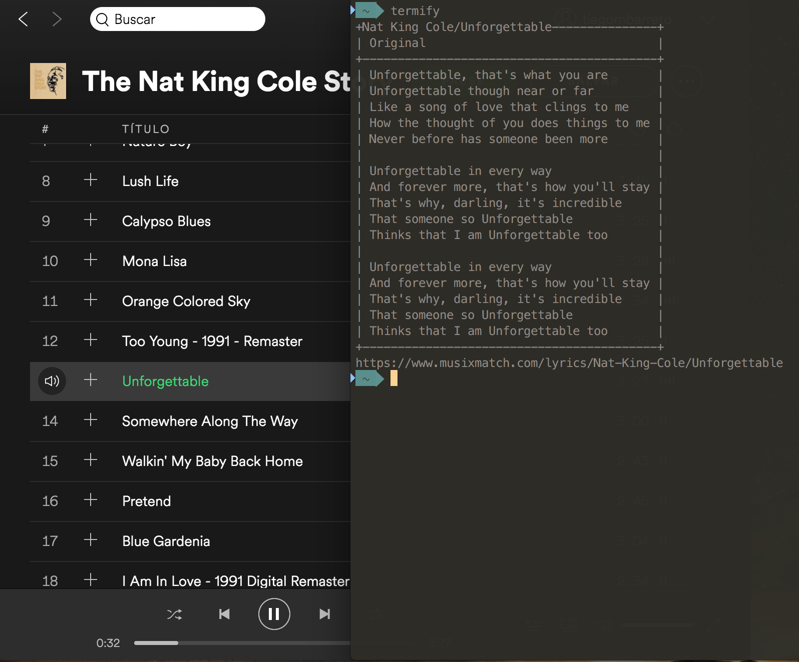
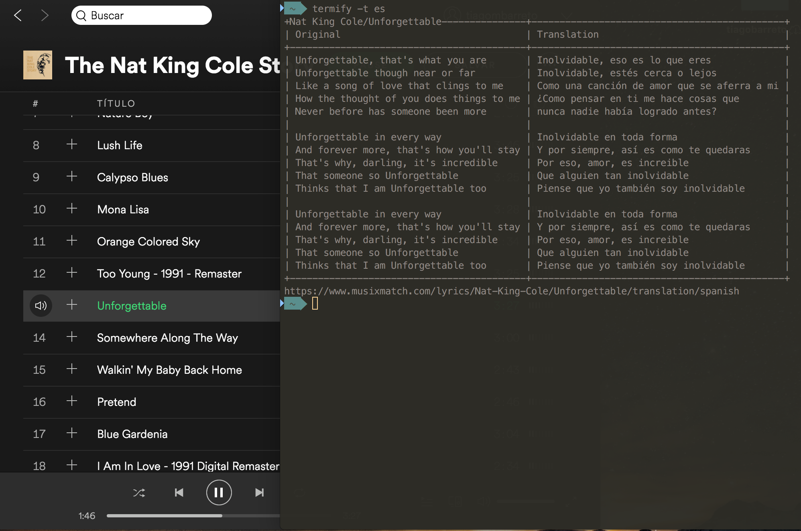

## Welcome to Termify
Termify is a simple service that permits you to retrieve lyrics playing in the **Spotify** using the **MusixMatch**.

## Requirements
To run Termify, you'll need:
* OS X
* Python 2.3
* Spotify

## Setup
To download Termify, click the "Releases" button at the top of the page. Download the latest release and unzip it.

If you'd rather, you can also download Termify with pip, using the following commands below.

```
 $ pip install termify
```
or
```
 $ git clone https://github.com/tiagobarreto/termify.git  
 $ cd termify
 $ sudo python setup.py install
```

## Usage
The Termify uses the **musixmatch.com** to displaying the lyrics playing in the **Spotify**.

* Print the lyrics of a track music (Use: termify en)
```
 $ termify

 +Nat King Cole/Unforgettable---------------+
 | Original                                 |
 +------------------------------------------+
 | Unforgettable, that's what you are       |
 | Unforgettable though near or far         |
 | Like a song of love that clings to me    |
 | How the thought of you does things to me |
 | Never before has someone been more       |
 |                                          |
 | Unforgettable in every way               |
 | And forever more, that's how you'll stay |
 | That's why, darling, it's incredible     |
 | That someone so Unforgettable            |
 | Thinks that I am Unforgettable too       |
 |                                          |
 | Unforgettable in every way               |
 | And forever more, that's how you'll stay |
 | That's why, darling, it's incredible     |
 | That someone so Unforgettable            |
 | Thinks that I am Unforgettable too       |
 +------------------------------------------+
 https://www.musixmatch.com/lyrics/Nat-King-Cole/Unforgettable
```



* Print the translation of a track music (Use: termify -t es)

```
 $ termify -t es

 +Nat King Cole/Unforgettable---------------+---------------------------------------------+
 | Original                                 | Translation                                 |
 +------------------------------------------+---------------------------------------------+
 | Unforgettable, that's what you are       | Inolvidable, eso es lo que eres             |
 | Unforgettable though near or far         | Inolvidable, estés cerca o lejos            |
 | Like a song of love that clings to me    | Como una canción de amor que se aferra a mi |
 | How the thought of you does things to me | ¿Como pensar en ti me hace cosas que        |
 | Never before has someone been more       | nunca nadie había logrado antes?            |
 |                                          |                                             |
 | Unforgettable in every way               | Inolvidable en toda forma                   |
 | And forever more, that's how you'll stay | Y por siempre, así es como te quedaras      |
 | That's why, darling, it's incredible     | Por eso, amor, es increible                 |
 | That someone so Unforgettable            | Que alguien tan inolvidable                 |
 | Thinks that I am Unforgettable too       | Piense que yo también soy inolvidable       |
 |                                          |                                             |
 | Unforgettable in every way               | Inolvidable en toda forma                   |
 | And forever more, that's how you'll stay | Y por siempre, así es como te quedaras      |
 | That's why, darling, it's incredible     | Por eso, amor, es increible                 |
 | That someone so Unforgettable            | Que alguien tan inolvidable                 |
 | Thinks that I am Unforgettable too       | Piense que yo también soy inolvidable       |
 +------------------------------------------+---------------------------------------------+
 https://www.musixmatch.com/lyrics/Nat-King-Cole/Unforgettable/translation/spanish
```



## Languages
 
 * English (**en**)
 * Spanish (**es**)
 * Italian (**it**)
 * French (**fr**)
 * Japanese (**jp**)
 * Deutsche (**de**)
 * Korean (**ko**)
 * Portuguese (**pt**/**pt-br**)

## Support
If you'd like, please consider telling your friends, social media followers, whomever about Termify.

Thanks for you support, being glad for your star, pull request, follow and issue.

When you see bugs. You can mail to me: iam@tiagobarreto.com.

